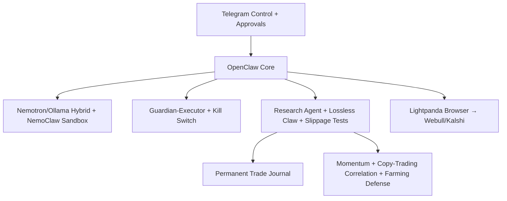

# blueHWbotTodoChecklist.md
**Final Production Checklist** — OpenClaw Trading Bot (Webull Stocks + Kalshi Events)
Version: March 2026 — incorporates every Grok conversation detail
Goal: Resilient, private, Telegram-only bot that never forgets failures and treats account death as project death.

## 1. Scope & Success Criteria (Pass/Fail)
- [ ] Primary platforms: Kalshi (events — API primary, browser fallback) + Webull (stocks — browser only)
- [ ] No Webull API dependency (rejection irrelevant)
- [ ] Permanent memory of EVERY losing trade (Lossless Claw)
- [ ] Guardian-Executor + death-penalty lineage restarts on >25% drawdown
- [ ] Research Agent runs twice daily with slippage-aware validation
- [ ] 100% Telegram façade (no SSH after initial setup)
- [ ] Total cost ≤ $15/month fixed + near-zero variable
- [ ] Paper-trade minimum 30 days with Research Agent validation before any live size

## 2. Infrastructure Setup (Lightsail/OpenClaw)
- [ ] Create Lightsail instance with official OpenClaw blueprint (4 GB bundle initially)
- [ ] First SSH: `openclaw doctor` + `openclaw gateway pair`
- [ ] Install Tailscale: `curl -fsSL https://tailscale.com/install.sh | sh` + `sudo tailscale up --ssh`
- [ ] Lock Lightsail firewall: SSH restricted to Tailscale IP/range only; delete 80/443
- [ ] Inside instance: `sudo ufw` default deny + allow only Tailscale range on port 22
- [ ] Downgrade bundle to 2 GB RAM after successful test

## 3. Model Routing & Runtime
- [ ] `openclaw onboard --auth-choice openrouter` + `openclaw onboard --auth-choice ollama`
- [ ] `openclaw plugins install nvidia-nemoclaw`
- [ ] Config: primary = `nemotron-4:14b` (or strongest Nemotron), research/guardian = same, fallback = OpenRouter auto
- [ ] Ollama for routine scans (qwen2.5:7b-q4 or similar quantized)
- [ ] OpenShell sandbox enabled
- [ ] If any plugin/model above is unavailable, pin fallback: primary = `ollama/qwen2.5:7b-q4` and fallback = `openrouter/openrouter/auto`

## 4. Browser & Execution Integrations
- [ ] `clawhub install lightpanda-browser`
- [ ] Config: engine = "lightpanda-cloud" + paste WSS token from console.lightpanda.io
- [ ] `clawhub install webull-browser` (stocks)
- [ ] `clawhub install kalshi-browser` (events — API once approved)

## 5. Core Plugins & Memory/Security Layers
- [ ] `clawhub install lossless-claw` + set contextEngine.plugin = "lossless-claw"
- [ ] `clawhub install guardian-executor` + killThreshold = 0.25 (25% DD)
- [ ] `clawhub install research-agent` + cron 8 AM / 8 PM
- [ ] `clawhub install news-sentinel` + agent-watcher + claude-watchdog
- [ ] Install fail2ban for SSH brute-force protection
- [ ] Enable immutable audit log + human approval on SOUL changes

## 6. Final SOUL.md (Replace Entire File)
- [ ] In `grokConvo.txt`, locate the exact anchor phrase: **"2. Updated Final SOUL.md (Replace Your File With This Complete Version)bash"**, then copy from **"Full final SOUL.md (copy-paste everything below):markdown"** through the end of that SOUL block.
- [ ] Save to `~/.openclaw/workspace/SOUL.md`
- [ ] Restart gateway: `sudo systemctl restart openclaw-gateway`

## 7. Telegram Ops Layer & Crons
- [ ] Install Telegram channel + enable configWrites + inlineButtons
- [ ] Add cron entries via `crontab -e`:
  - `0 9 * * * openclaw run-agent trading-daily-review`
  - `*/5 * * * * openclaw run-agent trading-scan`
  - `0 8,20 * * * openclaw run-agent research-cycle`
  - `0 3 * * 0 openclaw run-agent evolutionary-tune`
- [ ] Test commands in Telegram: /status, full scan, Research Agent cycle, autopsy of worst loss

## 8. Security Hardening
- [ ] Tailscale SSH only (no public port 22)
- [ ] ufw + fail2ban installed
- [ ] Credentials in .env + 600 permissions
- [ ] NemoClaw OpenShell sandbox active for all execution

## 9. Paper Trading Validation Gates (Must Pass Before Live)
- [ ] Research Agent runs 14+ days with slippage Monte Carlo
- [ ] Every losing trade (simulated) is recalled and lessons applied via Lossless Claw
- [ ] First-minute momentum + copy-trading correlation + bot-farming defense filters validated against historical failures
- [ ] No edge decay detected
- [ ] Guardian-Executor tested with artificial 25% DD trigger

## 10. Live Rollout Criteria
- [ ] 30+ days paper with positive expectancy + max DD <15%
- [ ] Research Agent confirms no farming patterns or regime shift
- [ ] Start with 0.1% risk only
- [ ] Weekly review of MEMORY.md + Research Agent summary

## Minimal System Flow (Updated)
